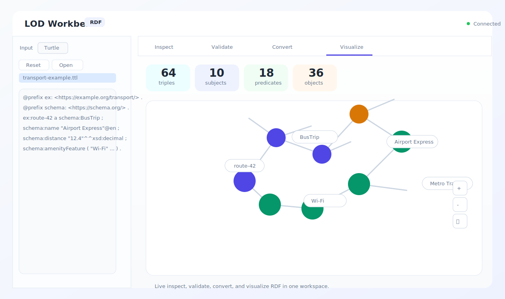
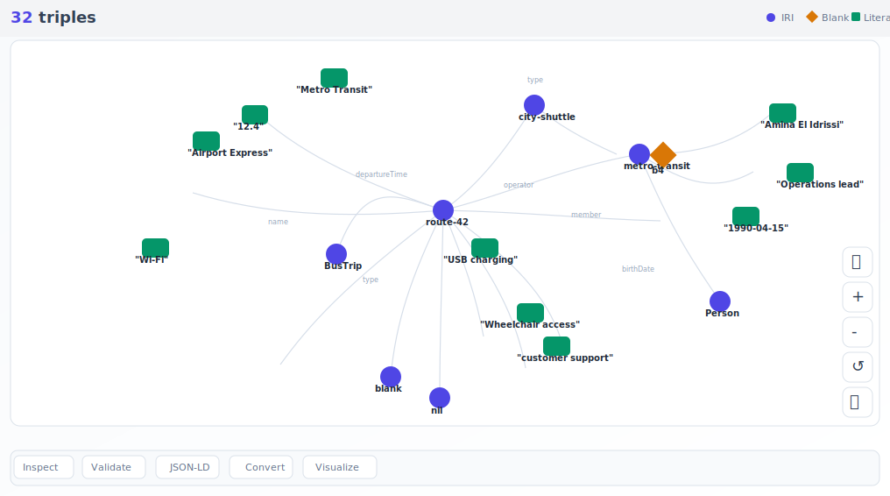
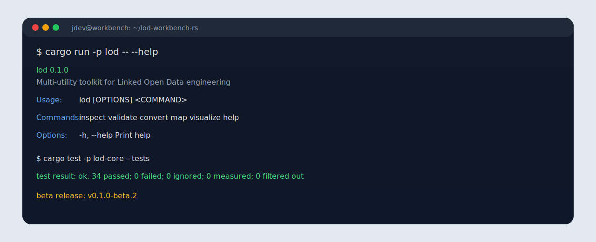

# LOD Workbench Documentation

This directory contains the project reference guide for LOD Workbench RS.

## What The Project Does

LOD Workbench is a Linked Open Data toolkit that can:

- inspect RDF data
- validate RDF syntax and IRI quality
- convert between Turtle, N-Triples, and JSON-LD
- map CSV rows to RDF
- visualize RDF graphs in the browser and export SVG
- expose the same capabilities through a Rust CLI, HTTP API, and React UI

## Architecture

The codebase is split into three layers:

- `crates/lod-core` contains the parser, model, services, and shared business logic
- `crates/lod-cli` provides the command-line interface
- `crates/lod-api` exposes the same functionality over HTTP for the web app
- `apps/web` renders the browser UI and graph visualizer

The `LodWorkbench` façade in `crates/lod-core/src/facade.rs` ties the core services together so the CLI, API, and frontend all call the same logic.

## Main Data Flow

1. User edits or loads RDF text in the web editor, CLI, or API.
2. The parser builds an in-memory `LodGraph`.
3. Inspection, validation, conversion, and visualization all reuse that graph.
4. The API serializes structured JSON responses.
5. The browser visualizer renders nodes and edges from the returned graph payload.

## Supported Inputs

The project currently supports a compact subset of RDF features that is enough for teaching, demos, and controlled examples:

- Turtle prefixes and base IRIs
- N-Triples line-based parsing
- JSON-LD subset parsing and serialization
- blank nodes, blank node property lists, RDF lists, and RDF bags
- typed literals and language-tagged literals

## Running Locally

```bash
cargo build --workspace
cargo test --workspace
cargo run -p lod-api
cd apps/web
npm install
npm run dev
```

Open the browser app at <http://127.0.0.1:5173>.

## CLI Commands

```bash
cargo run -p lod -- inspect examples/data.ttl
cargo run -p lod -- validate examples/data.ttl examples/shapes.ttl --report reports/report.html
cargo run -p lod -- convert examples/data.ttl /tmp/data.nt --from turtle --to n-triples
cargo run -p lod -- map examples/researchers.csv examples/mapping.yml /tmp/researchers.ttl --to turtle
cargo run -p lod -- visualize examples/data.ttl --output reports/graph.html
```

## HTTP API

- `GET /api/health`
- `POST /api/inspect-text`
- `POST /api/validate-text`
- `POST /api/convert-text`
- `POST /api/visualize-text`

The API is intentionally thin: it validates the request, calls the core service, and returns a JSON payload for the UI.

## Web UI Notes

The React app includes:

- live text editing with automatic refresh
- inspect, validate, convert, and visualize tabs
- drag, zoom, and pan in the RDF graph view
- SVG export for the rendered graph
- input-file saving in the currently selected format

## Screenshots

| Web UI | Graph | CLI |
| --- | --- | --- |
| [](screenshots/web-ui.svg) | [](screenshots/graph-preview.svg) | [](screenshots/cli-output.svg) |

## Release Flow

- `beta` branch triggers the Pages deployment workflow
- tagged commits such as `v0.1.0-beta.2` trigger the GitHub Release workflow
- release archives include the built Rust binaries and web client bundle

## Troubleshooting

- If the UI says the API is unreachable, make sure `lod-api` is running on `127.0.0.1:8080`.
- If validation fails on a sample, check that the RDF syntax matches the supported subset.
- If graph export looks clipped, use the SVG export button in the visualizer to download the full graph bounds.
